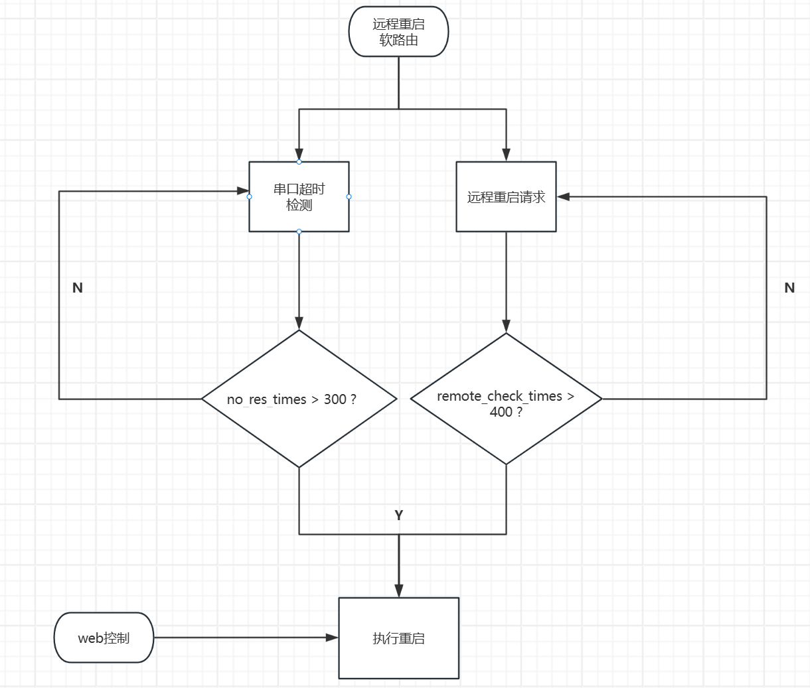
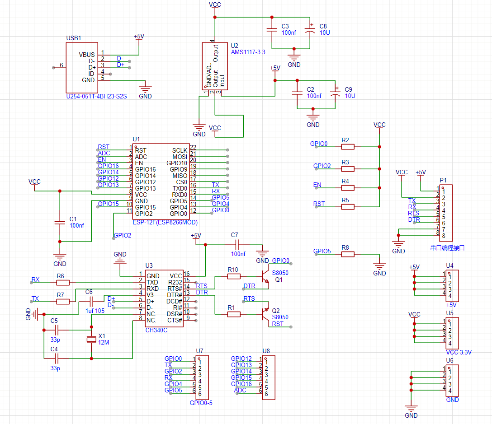

# nas-autoreboot
esp8266 nas autoreboot tool  

基于esp8266的家用nas自动（远程）重启工具

# Work flow chart

# 文件列表

### wificlient.ino

esp8266 arduino 程序文件

需要替换文件中的所有`<??>`标签 包括`host` `host_port` `wifi_ssid` `wifi_password`

#### 串口超时重启

其中硬件采用esp8266 core board USB转串口芯片为WCH CH340 在Debian中免驱.

程序默认波特率为9600 默认串口超时时间为`300S`

每秒钟向串口发送文本`monitor mode` 并检测串口回传心跳包 超时则重启设备

注意：nas端需部署串口监听工具 `serial_test.c`

#### 远程重启

通过远程访问`http://{host}:{host_port}/read` 判断是否需要强制重启本地主机

每隔`400S`进行一次判定

返回值为`reset=1`时重启设备,并访问`http://{host}:{host_port}/clear_reset`将`reset`标志复位

注意：服务器端需部署远程重启监听工具 `remote_reboot.c`

### serial_test.c

默认监听`/dev/ttyUSB0`设备 

当接收到`monitor mode`文本后自动返回`OK!`

### remote_reboot.c

默认监听`8765`端口

`/read`为读取当前reset标志位

`/clear_reset`将`reset`标志复位(reset=0)

`/set_reset`将`reset`标志置位(reset=1)

# ESP8266核心板原理图
