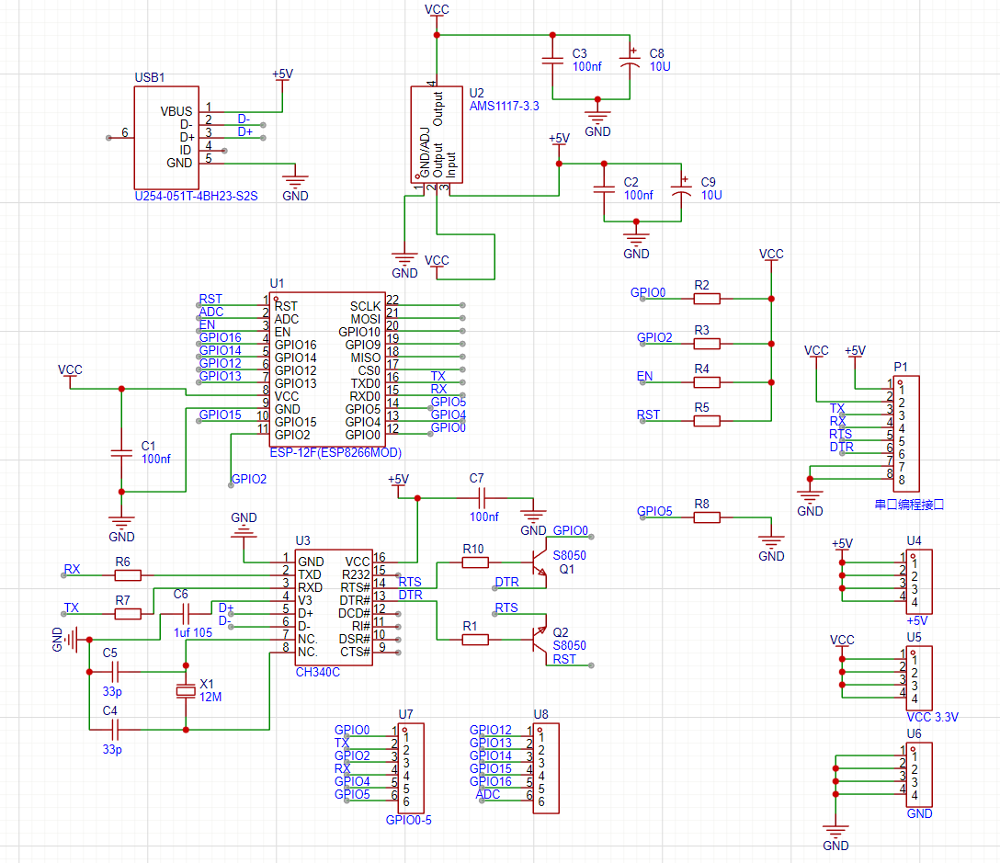

# NAS 自动重启工具

[English](./README.md)

基于 ESP8266 的家用 NAS 自动（远程）重启工具。

## 功能特点

- 串口超时监控和自动重启
- HTTP 远程重启功能
- 简单的配置和部署

## 硬件要求

- ESP8266 核心板
- USB 转串口转换器（WCH CH340，Debian 系统免驱）
- 重置引脚连接到 GPIO5

## 系统架构

## 组件说明

### 1. ESP8266 Arduino 程序（`wificlient.ino`）

必要配置：
- 替换所有 `<??>` 标签，包括：
  - `host`
  - `host_port`
  - `wifi_ssid`
  - `wifi_password`

#### 串口监控模式
- 波特率：9600
- 超时时间：300 秒
- 每秒发送 "monitor mode" 文本
- 等待心跳包响应
- 超时自动重启

#### 远程重启模式
- 每 400 秒轮询 `http://{host}:{host_port}/read`
- 当响应为 `reset=1` 时触发重启
- 重启后自动通过 `/clear_reset` 复位标志

### 2. 串口监视器（`serial_test.c`）

- 默认监听 `/dev/ttyUSB0`
- 收到 "monitor mode" 时回复 "OK!"

### 3. 远程重启服务器（`remote_reboot.c`）

默认端口：8765

接口说明：
- `/read` - 获取重置标志状态
- `/clear_reset` - 清除重置标志（设为 0）
- `/set_reset` - 设置重置标志（设为 1）

## 硬件原理图

## 文件列表

1. `wificlient.ino` - ESP8266 Arduino 程序文件
2. `serial_test.c` - 串口监听工具
3. `remote_reboot.c` - 远程重启监听工具